# DANH MỤC SƠ ĐỒ THIẾT KẾ HỆ THỐNG - QUẢN LÝ PHÒNG TRỌ

Thư mục này chứa toàn bộ sơ đồ kỹ thuật (ảnh PNG độ nét cao, vector SVG và mã nguồn Mermaid .mmd) phục vụ Báo cáo đồ án (>50 trang) và Slide thuyết trình VTC Academy.

| STT | Tên Sơ Đồ | File Ảnh PNG | File Vector SVG | File Mã Nguồn MMD |
| :--- | :--- | :--- | :--- | :--- |
| 1 | **Sơ đồ Use Case Tổng quan Hệ thống** | [`1_use_case_diagram.png`](./1_use_case_diagram.png) | [`1_use_case_diagram.svg`](./1_use_case_diagram.svg) | [`1_use_case_diagram.mmd`](./1_use_case_diagram.mmd) |
| 2 | **Sơ đồ Quan hệ Thực thể CSDL (ERD)** | [`2_erd_database_diagram.png`](./2_erd_database_diagram.png) | [`2_erd_database_diagram.svg`](./2_erd_database_diagram.svg) | [`2_erd_database_diagram.mmd`](./2_erd_database_diagram.mmd) |
| 3 | **Sơ đồ Lớp Chi tiết (UML Class Diagram)** | [`3_uml_class_diagram.png`](./3_uml_class_diagram.png) | [`3_uml_class_diagram.svg`](./3_uml_class_diagram.svg) | [`3_uml_class_diagram.mmd`](./3_uml_class_diagram.mmd) |
| 4 | **Sơ đồ Quy trình Phân làn: Lập hóa đơn & Tính điện EVN (BPMN Swimlane)** | [`4_bpmn_swimlane_billing.png`](./4_bpmn_swimlane_billing.png) | [`4_bpmn_swimlane_billing.svg`](./4_bpmn_swimlane_billing.svg) | [`4_bpmn_swimlane_billing.mmd`](./4_bpmn_swimlane_billing.mmd) |
| 5 | **Sơ đồ Quy trình Phân làn: Ký hợp đồng & Bàn giao phòng** | [`5_bpmn_swimlane_contract.png`](./5_bpmn_swimlane_contract.png) | [`5_bpmn_swimlane_contract.svg`](./5_bpmn_swimlane_contract.svg) | [`5_bpmn_swimlane_contract.mmd`](./5_bpmn_swimlane_contract.mmd) |
| 6 | **Sơ đồ Kiến trúc Phân tầng 3-Tier (Layered Architecture)** | [`6_layered_architecture.png`](./6_layered_architecture.png) | [`6_layered_architecture.svg`](./6_layered_architecture.svg) | [`6_layered_architecture.mmd`](./6_layered_architecture.mmd) |

---

## CHI TIẾT CÁC SƠ ĐỒ

### 1. Sơ đồ Use Case Tổng quan Hệ thống
**Mô tả**: Mô tả ranh giới hệ thống, 2 tác nhân (Admin & Staff) và các ca sử dụng theo phân quyền RBAC.

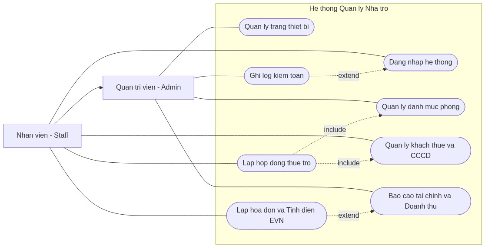

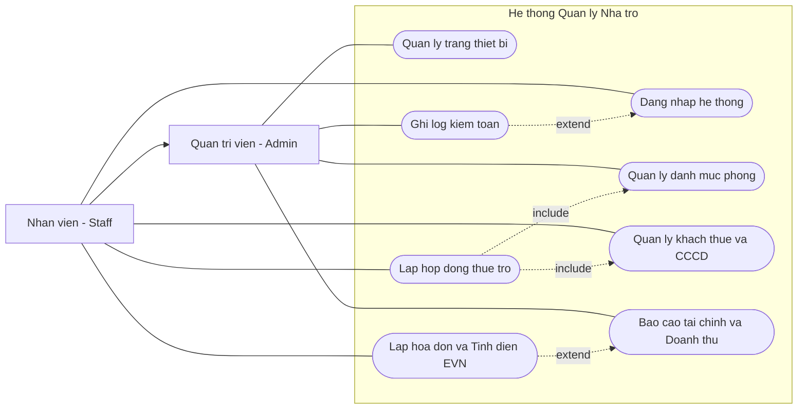

---

### 2. Sơ đồ Quan hệ Thực thể CSDL (ERD)
**Mô tả**: Mô tả 8 bảng dữ liệu SQLite, khóa chính (PK), khóa ngoại (FK) và mối quan hệ thực thể.

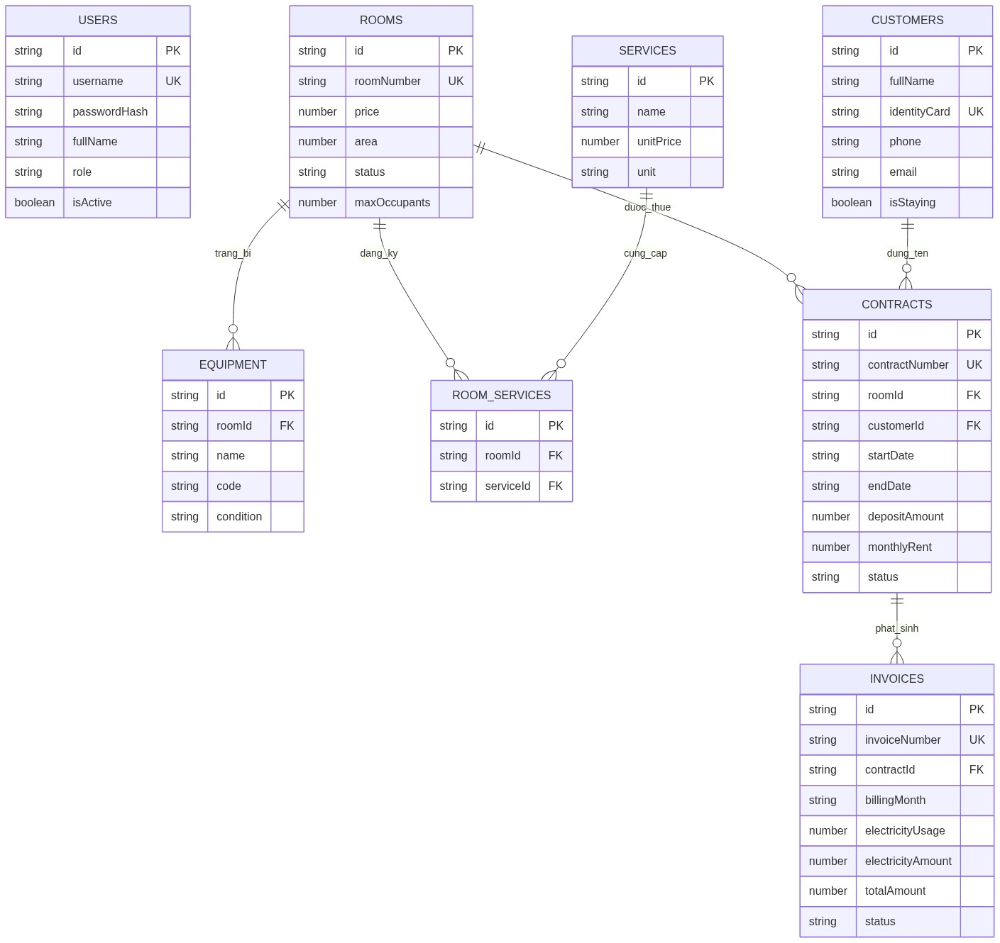

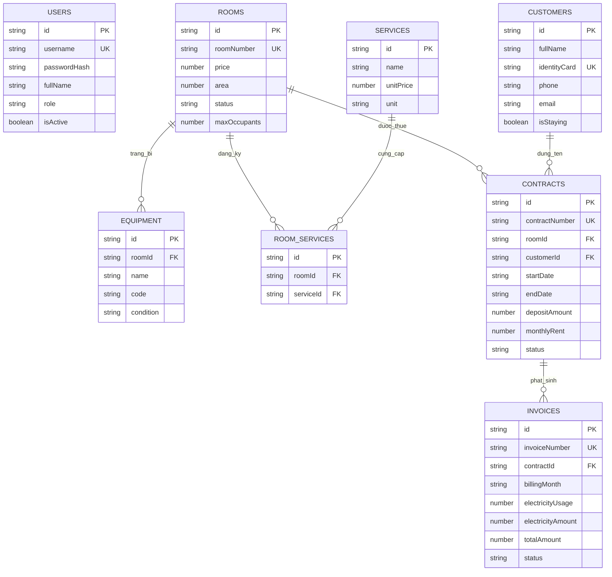

---

### 3. Sơ đồ Lớp Chi tiết (UML Class Diagram)
**Mô tả**: Mô tả tính đóng gói, kế thừa BaseEntity, generic repository và các nghiệp vụ tính toán.

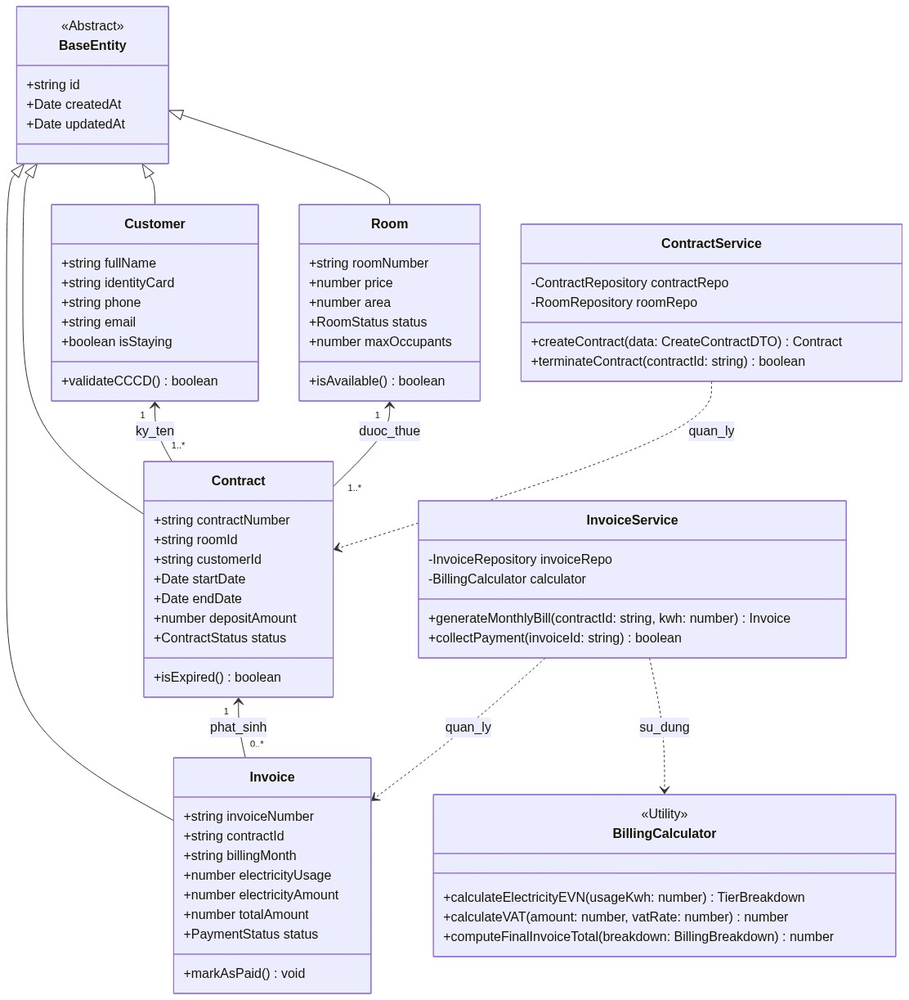

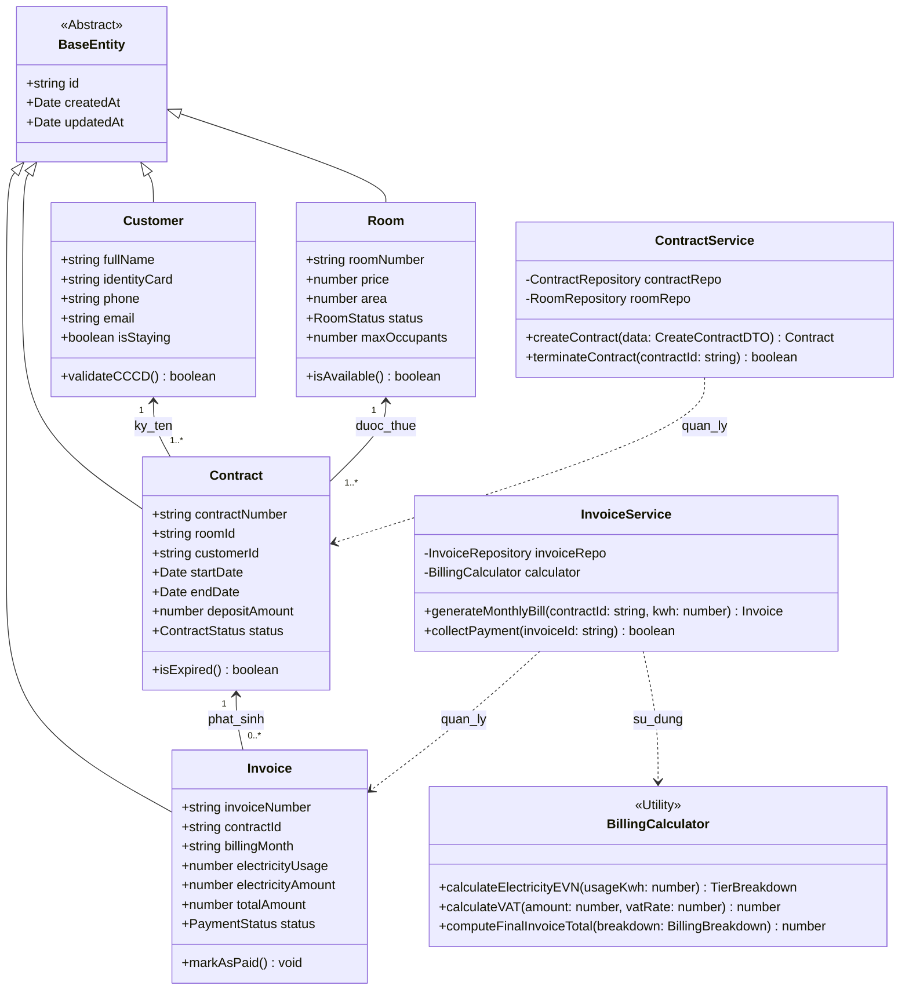

---

### 4. Sơ đồ Quy trình Phân làn: Lập hóa đơn & Tính điện EVN (BPMN Swimlane)
**Mô tả**: Phân làn 3 đối tượng (Khách thuê, Nhân viên, Hệ thống) xử lý lũy tiến 6 bậc điện và thuế VAT 8%.

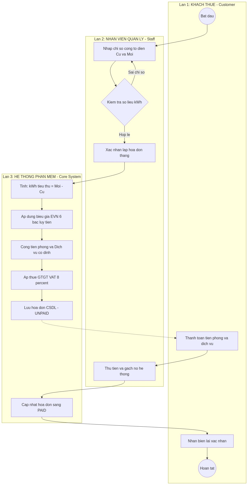

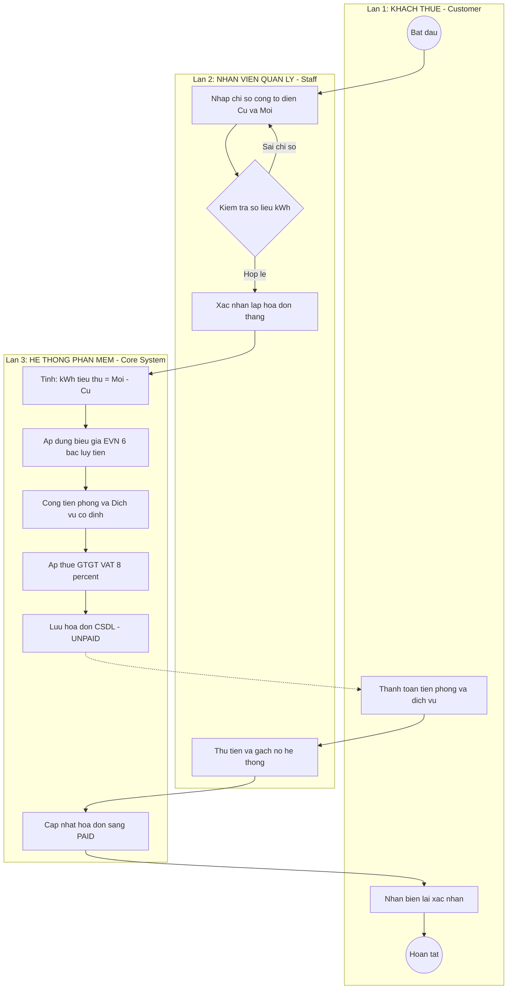

---

### 5. Sơ đồ Quy trình Phân làn: Ký hợp đồng & Bàn giao phòng
**Mô tả**: Phân làn nghiệp vụ khi tiếp nhận khách mới, xác thực CCCD 12 số và chuyển trạng thái phòng.

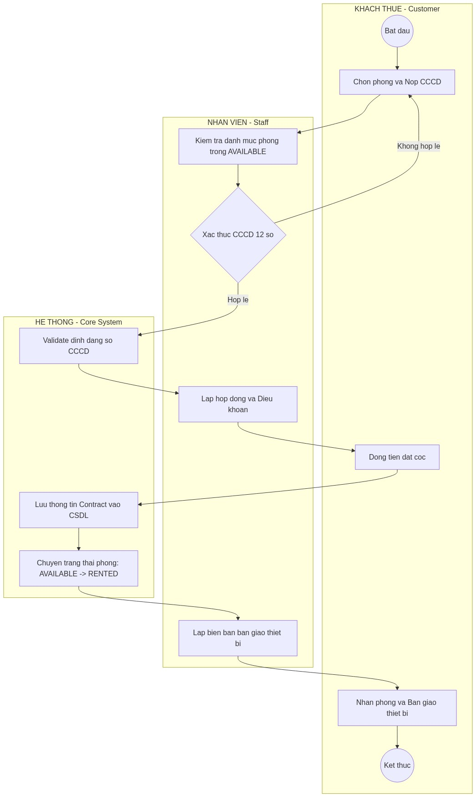

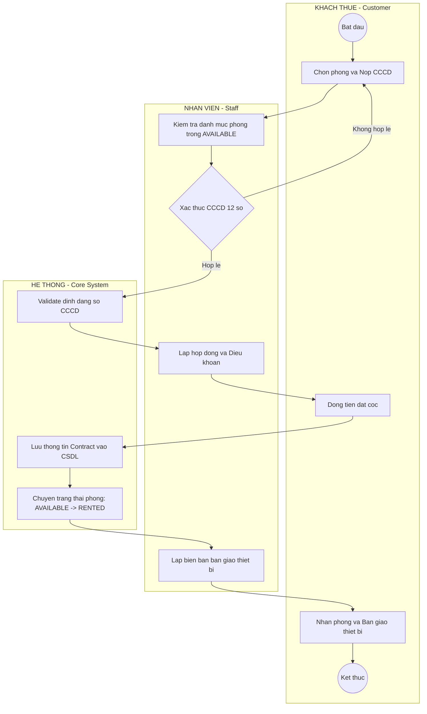

---

### 6. Sơ đồ Kiến trúc Phân tầng 3-Tier (Layered Architecture)
**Mô tả**: Kiến trúc tách biệt Presentation, Business Logic và Data Access Layer.

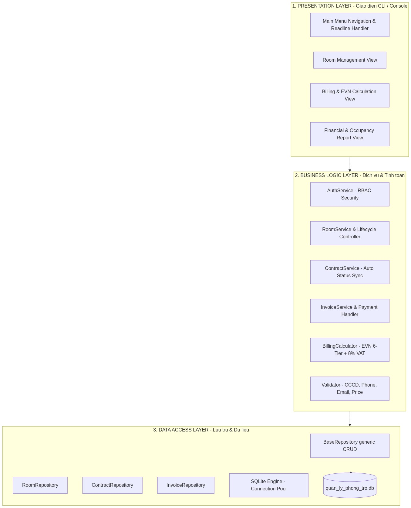

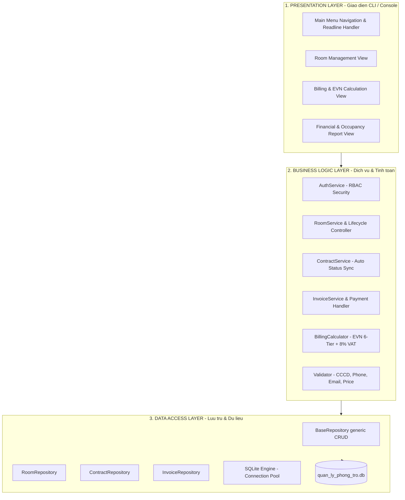

---

